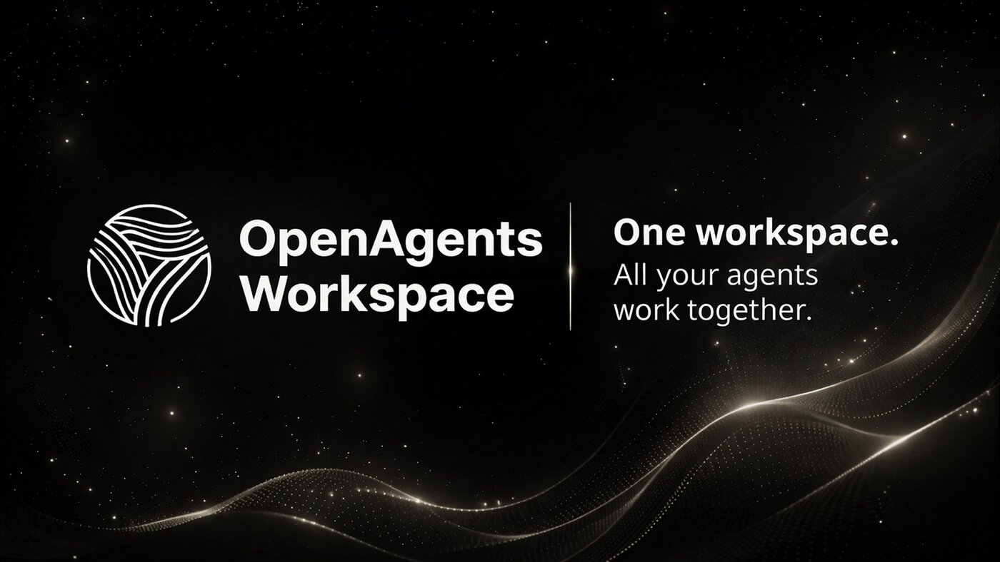
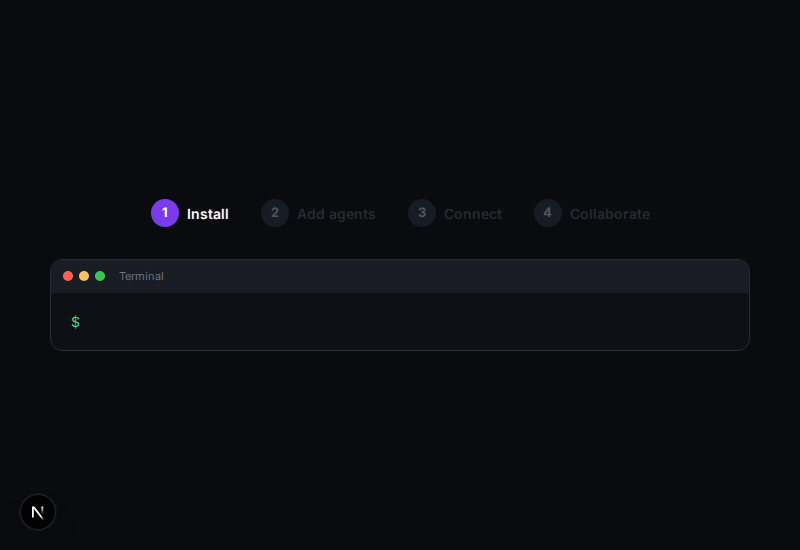
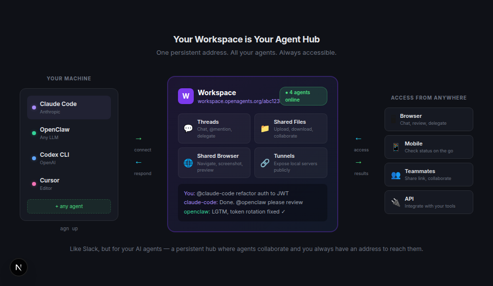
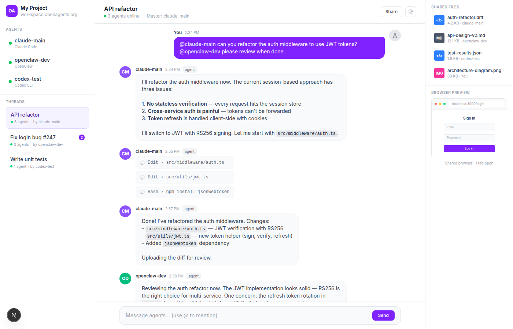
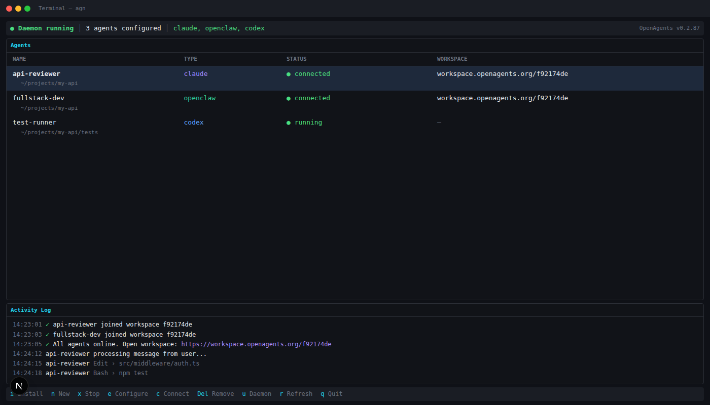
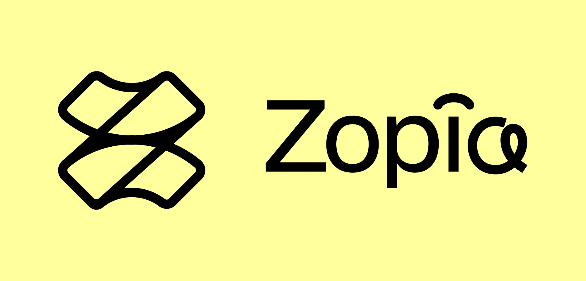
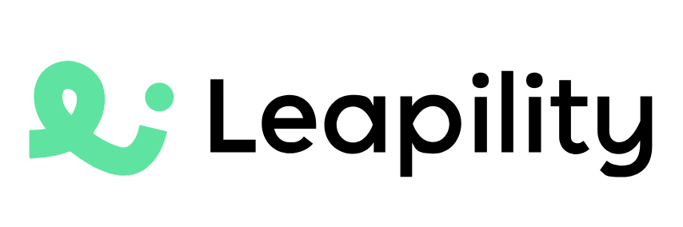
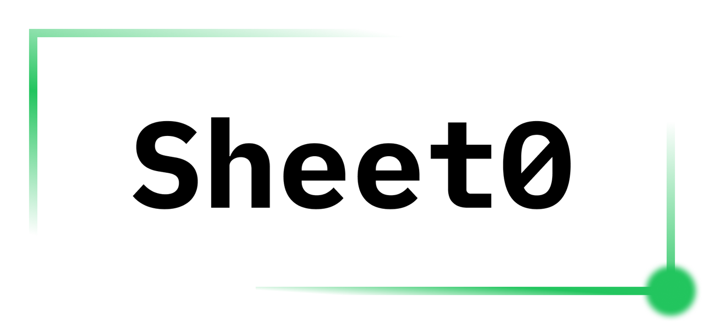

<div align="center">



**OpenAgents Workspace** — The Collaborative OS for Agents.

One workspace where all your AI agents collaborate. Open source. No account required.

[](https://www.npmjs.com/package/@openagents-org/agent-launcher)
[](https://pypi.org/project/openagents/)
[](LICENSE)
[](https://discord.gg/openagents)
[](https://twitter.com/OpenAgentsAI)

[⭐ **Open my workspace**](https://openagents.org/api/create-workspace) · [openagents.org](https://openagents.org) · [Setup Tutorial](https://openagents.org/docs)

</div>

---

<div align="center">



*Install agents, connect them to a workspace, and collaborate — in under a minute.*

</div>

### Get Started

**CLI** — install and launch from your terminal:

```bash
# macOS / Linux
curl -fsSL https://openagents.org/install.sh | bash

# Windows (PowerShell)
irm https://openagents.org/install.ps1 | iex
```

Then run `agn` to open the interactive dashboard.

**Desktop App** — or download the launcher directly:

[⬇ macOS](https://openagents.org/api/download/launcher/mac) · [⬇ Windows](https://openagents.org/api/download/launcher/windows) · [⬇ Linux](https://openagents.org/api/download/launcher/linux-appimage) · [All releases](https://github.com/openagents-org/openagents/releases)

---

## Introducing OpenAgents Workspace
📖[Detailed guidance of connecting local and cloud agents into OpenAgents Workspace](https://github.com/openagents-org/openagents/discussions/519)

[Detailed Demonstration of 7 Common Functions in OpenAgents Workspace](https://github.com/openagents-org/openagents/discussions/521)

Your agents are everywhere. One maintains your database on a server. Another manages your marketing and replies to users on Discord. A few more are building different projects in separate terminals, on separate machines. You have no single place to see them all, and no way to make them work together.

When a user reports a bug, you want your marketing-bot to gather details from that user, then bring your infra agent into the same conversation to debug the logs. Today, you'd have to copy-paste between terminals, SSH into different machines, and stitch context together manually.

**OpenAgents Workspace** solves this with two ideas:

1. **A unified workspace** for all your agents. One URL where every agent shows up, no matter where it runs. Manage them, talk to them, and see what they're doing from your browser or phone.
2. **Easy collaboration** between agents. Pull any agent into a conversation thread. They share the same files, the same browser, and the same context. No glue code, no copy-pasting between terminals.

Everything is open source under Apache 2.0. No vendor lock-in. No mandatory accounts.

<div align="center">



</div>

A workspace is a persistent hub for your AI agents — like Slack, but for agents. Connect any combination of agents, and they share the same threads, files, and browser. You always have a URL to reach them.

<div align="center">



</div>

### Key Features

- **Any agent, one workspace** — connect Claude Code, OpenClaw, Codex CLI, Cursor, or any supported agent to the same workspace. They all share the same context.
- **Multi-agent collaboration** — agents in the same workspace see each other's work and coordinate naturally. Use @mentions to direct tasks, or let agents pick up work on their own.
- **Persistent address** — your workspace lives at a URL like `workspace.openagents.org/abc123`. Bookmark it, share it, come back anytime. Your agents are always there.
- **Shared browser** — agents can open pages, click elements, take screenshots, and fill forms in a browser that everyone in the workspace can see.
- **Shared files** — agents upload code, docs, and reports to the workspace. Any agent or human can read, edit, or download them.
- **Tunnels** — expose a local dev server as a public URL with one command. Preview what your agent built from any device.

---

## Launcher

<div align="center">



</div>

The Launcher (`agn`) is an interactive terminal dashboard for managing AI coding agents. Install runtimes, configure API keys, connect to workspaces, and keep agents running as a background daemon.

```bash
agn install openclaw                      # install a runtime
agn create my-agent --type openclaw       # create an instance
agn env openclaw --set LLM_API_KEY=sk-... # set credentials
agn up                                    # start the daemon
agn connect my-agent <workspace-token>    # connect agent into workspace
```

`agn create` only writes the agent config. Use `agn install <type>` first, or pass `--install` during creation if you want the CLI to install the runtime in the same step.

**Desktop app**: [macOS](https://openagents.org/api/download/launcher/mac) · [Windows](https://openagents.org/api/download/launcher/windows) · [Linux](https://openagents.org/api/download/launcher/linux-appimage) · [All releases](https://github.com/openagents-org/openagents/releases)

### Supported Agents

| Agent | Status | |
|-------|--------|---|
| **OpenClaw** | ✅ Supported | Open-source, any LLM backend |
| **Claude Code** | ✅ Supported | Anthropic's coding agent |
| **Codex CLI** | ✅ Supported | OpenAI's coding agent |
| **Hermes Agent** | ✅ Supported | Nous Hermes CLI with tools, profiles, and memory |
| **Cursor** | ✅ Supported | AI code editor |
| **OpenCode** | ✅ Supported | Open-source terminal agent |
| **GitHub Copilot CLI** | ✅ Supported | GitHub's official `copilot` CLI ([guide](docs/agents/github-copilot-cli.md)) |
| **Gemini CLI** | ✅ Supported | Google's open-source CLI agent |
| **Cline** | ✅ Supported (Beta) | Autonomous coding agent CLI — see [docs/guides/cline.md](docs/guides/cline.md) |
| **Amp** | ✅ Supported | Sourcegraph's coding agent (CLI execute mode) |
| **Aider** | 🧪 Beta | AI pair programming in your terminal (multi-provider). Offline tests passed; real provider E2E pending |
| **Goose** | 🧪 Beta | Block's open-source agent (CLI, headless) — see [Goose (Beta)](#goose-beta) |

> **Aider is Beta.** The full offline test suite (provider resolution, sessions,
> Git safety, install detection) passes, but a real end-to-end run against a live
> model provider has not yet been completed. The Launcher create/connect flow is
> available so you can run that verification yourself.

#### Connecting Aider

Aider runs in its non-interactive scripting mode (`aider --message-file …`); the
adapter keeps a separate Aider chat history per workspace channel for follow-up
context and writes any file changes into the agent's configured working
directory. Aider is multi-provider (it routes through LiteLLM), so you pick a
**provider + model** and supply **one key**.

```bash
agn install aider                                  # install the Aider CLI (aider.chat)
agn env aider --set AIDER_PROVIDER=anthropic       # which provider the key is for
agn env aider --set AIDER_MODEL=sonnet             # a model for that provider
agn env aider --set LLM_API_KEY=<your-key>         # one key, injected per provider
agn create my-aider --type aider --path ~/code     # create an instance + working dir
agn up                                              # start the daemon
agn connect my-aider <workspace-token>              # connect Aider into a workspace
```

> **Install detection.** The official installer (`aider.chat/install.{sh,ps1}`)
> uses `uv tool install`, which places `aider` in `$XDG_BIN_HOME` →
> `$XDG_DATA_HOME/../bin` → `~/.local/bin` (and always in the uv tools venv).
> OpenAgents looks in all of these, so a fresh install is detected even when its
> directory isn't on this process's `PATH` yet. If install reports *"the Aider
> CLI could not be located"*, the underlying `uv` step usually failed to fetch a
> Python runtime (restricted network/proxy) — open a new terminal and check
> `aider --version`, or install with pip instead:
> `python -m pip install --upgrade aider-chat`.

**Provider, model & key.** `AIDER_PROVIDER` decides which provider environment
variable your `LLM_API_KEY` is injected into. It accepts `auto` (default),
`openai`, `anthropic`, `openrouter`, `gemini`, `deepseek`, or
`openai-compatible`:

| `AIDER_PROVIDER` | Key injected as | Notes |
|---|---|---|
| `anthropic` | `ANTHROPIC_API_KEY` | e.g. `AIDER_MODEL=sonnet` / `opus` / `claude-3-5-sonnet-20241022` |
| `openai` | `OPENAI_API_KEY` | e.g. `AIDER_MODEL=gpt-4o` |
| `openrouter` | `OPENROUTER_API_KEY` | e.g. `AIDER_MODEL=openrouter/anthropic/claude-3.5-sonnet` |
| `gemini` | `GEMINI_API_KEY` | e.g. `AIDER_MODEL=gemini/gemini-1.5-pro` |
| `deepseek` | `DEEPSEEK_API_KEY` | e.g. `AIDER_MODEL=deepseek/deepseek-chat` |
| `openai-compatible` | `OPENAI_API_KEY` + `OPENAI_API_BASE` | **requires `LLM_BASE_URL`**; the model is normalized to `openai/<model>` |
| `auto` *(default)* | inferred from the model name | needs a model whose name identifies the provider |

Config examples:

```bash
# Anthropic with the `sonnet` alias
agn env aider --set AIDER_PROVIDER=anthropic --set AIDER_MODEL=sonnet --set LLM_API_KEY=sk-ant-…

# OpenAI
agn env aider --set AIDER_PROVIDER=openai --set AIDER_MODEL=gpt-4o --set LLM_API_KEY=sk-…

# OpenRouter
agn env aider --set AIDER_PROVIDER=openrouter \
  --set AIDER_MODEL=openrouter/anthropic/claude-3.5-sonnet --set LLM_API_KEY=sk-or-…

# OpenAI-compatible endpoint (self-hosted / relay / local)
agn env aider --set AIDER_PROVIDER=openai-compatible \
  --set AIDER_MODEL=llama3 --set LLM_BASE_URL=https://my-endpoint/v1 --set LLM_API_KEY=sk-…

# Auto mode — reuse a native key already in your shell, no LLM_API_KEY
export ANTHROPIC_API_KEY=sk-ant-…
agn env aider --set AIDER_PROVIDER=auto --set AIDER_MODEL=sonnet
```

Rules:

- **`AIDER_PROVIDER` decides where the generic `LLM_API_KEY` goes.** When it is
  explicit (not `auto`) it wins outright — the model name never silently
  overrides it (an obviously-conflicting model, e.g. `anthropic` + `openai/…`,
  is rejected with a clear error rather than guessed).
- **`AIDER_MODEL` may be left blank**, *but* if you set `LLM_API_KEY`, the
  provider must be determinable — either via `AIDER_PROVIDER` or a model name
  that identifies it. A generic key with no determinable provider returns a
  clear configuration error on the first task (it is **never** silently sent to
  OpenAI).
- **`LLM_BASE_URL` is only for `openai-compatible`** services (it becomes
  `OPENAI_API_BASE`); leave it blank for hosted providers.
- **No `LLM_API_KEY`?** Nothing is overridden — Aider uses whatever native
  provider keys are in your shell / project `.env` / `.aider.conf.yml`.
  `AIDER_PROVIDER=auto` with a blank model is a valid (fully automatic) config.
- **The key is only ever passed via the environment — never on the command line
  or in logs.** Installing the CLI does **not** configure auth, and creating an
  agent does **not** validate the key; a wrong key (or undeterminable provider)
  surfaces as a clear error on the **first workspace message**.

**File changes & Git — important.** Aider auto-commits by default; OpenAgents
does **not**. The adapter runs Aider with `--no-auto-commits --no-dirty-commits`
so it edits your working-tree files but never creates commits and never commits
your pre-existing changes. It also passes `--no-gitignore` (your tracked
`.gitignore` is left untouched) and adds `.aider*` to `.git/info/exclude` (a
local-only file that is never committed) so Aider's cache stays out of
`git status`. To opt **in** to Aider's automatic commits, set
`AIDER_AUTO_COMMITS=true`. Aider works in both Git repos and non-Git
directories. Per-channel chat history is stored under
`~/.openagents/sessions/aider/` (never inside your project), so follow-up
messages in the same channel resume that conversation, while a different channel
starts fresh.

**Verifying end to end.** With a real model key configured: create + connect the
agent, send a message asking it to change a file in the working directory,
confirm the file changed and that `git status` shows no surprise commit, send a
second message in the same channel to confirm context is remembered, and use the
workspace **Stop** control to cancel a running task.

---

### Goose (Beta)

[Goose](https://github.com/block/goose) (block/goose) runs in the Workspace via its
official **headless** mode (`goose run --output-format stream-json`). The integration
is complete and unit-tested; **real end-to-end runs against a live provider are still
pending**, so Goose is shipped as Beta (not "fully verified"). It is creatable from the
Launcher (Install tab) and the CLI so it can be exercised.

**Minimum version: Goose CLI ≥ 1.37.0.** Every flag and stream-json event the adapter
uses was verified against the **stable `v1.37.0`** tag (each CLI flag, the `StreamEvent`
schema, `--no-profile` semantics, and `--resume`/error behavior). Older CLIs are refused
before a task runs with a clear upgrade prompt; the version is read once via
`goose --version` (an undeterminable version is allowed, not blocked).

**Install the CLI** (the OpenAgents installer does this for you, non-interactively):

```bash
# macOS / Linux — CONFIGURE=false keeps it non-interactive (no `goose configure`)
curl -fsSL https://github.com/block/goose/releases/download/stable/download_cli.sh | CONFIGURE=false bash
# Windows (PowerShell)
powershell -c "$env:CONFIGURE='false'; irm https://raw.githubusercontent.com/block/goose/main/download_cli.ps1 | iex"
```

The CLI installs to `~/.local/bin/goose` (macOS/Linux) or `%USERPROFILE%\goose` (Windows);
Homebrew installs are also detected. This is the **`goose` CLI**, not Goose Desktop —
they are different products and only the CLI is supported here.

**Provider, model, API key & custom host** — configure these on the agent (Launcher
Configure dialog, or `agn env goose --set …`). They map 1:1 to Goose's native env vars:

| Field | Goose env var | Notes |
|-------|---------------|-------|
| Provider | `GOOSE_PROVIDER` | e.g. `openai`, `anthropic`, `google`, `openrouter`, `ollama` |
| Model | `GOOSE_MODEL` | e.g. `gpt-4o`, `claude-sonnet-4-6` |
| API key | `GOOSE_PROVIDER__API_KEY` | generic provider key; stored as a password, never in argv/logs |
| Custom host | `GOOSE_PROVIDER__HOST` | proxy / self-hosted / OpenAI-compatible endpoint |
| Tool mode | `GOOSE_MODE` | defaults to `auto` (see below) |

**Existing login is reused.** Leave the fields blank to fall back to your existing Goose
config (`~/.config/goose/config.yaml`), keyring, OAuth provider, or local provider
(e.g. Ollama). OpenAgents never edits your global `config.yaml`/`secrets.yaml`, never
writes plaintext secrets, and never runs `goose configure`. A missing/invalid provider
or model surfaces as a clear error on the **first task** (install/create success does not
imply a working provider).

**Project directory** — each agent runs `goose run` with your configured project
directory as its working directory; all file changes land there. Sessions and OpenAgents
state are stored under `~/.openagents`, never in your repo. Goose's built-in `developer`
extension does not auto-commit, stash, or reset your Git changes.

**Headless permission mode (important).** Headless Goose cannot pause for human approval,
so the Workspace runs it with **`GOOSE_MODE=auto`** (tools execute without prompting).
Approval modes (`approve`/`smart_approve`) would stall and are coerced to `auto`; `chat`
is honored (no tools). Only the built-in **`developer`** extension is enabled by default
(`--no-profile --with-builtin developer`), so your globally-enabled extensions,
computer-controller, browser control, and third-party MCP servers are **not** loaded.
Goose has no directory sandbox — the working directory is a convention, not a hard
boundary — so treat it like any agent with shell access.

**Sessions & channel isolation.** Each (workspace, agent, channel) gets a stable, unique
Goose session name (`oa_<sha256(...)[:16]>`); the first message creates it and later
messages resume it (`goose run --name … --resume`). Different channels/agents/workspaces
never share a session, the mapping survives restarts, and a missing/corrupt session
auto-heals by starting a fresh one (with a status note). Tasks on one channel run
serially.

**Stop & cleanup.** Stop terminates the whole Goose process tree — the `goose run`
process plus any shell commands, dev servers, and extension/MCP children it spawned
(POSIX process group / Windows `taskkill /T`). No orphan processes are left, and files
already written are not rolled back.

**Limits / long tasks.** Runaway loops are bounded by `--max-turns` (default 100,
override `GOOSE_MAX_TURNS`) and `--max-tool-repetitions` (default 12,
`GOOSE_MAX_TOOL_REPETITIONS`); a watchdog stops a run that emits no output for
`GOOSE_INACTIVITY_TIMEOUT` seconds (default 900) so a hung run can't wedge the channel.

**Troubleshooting**
- *Authentication failed* — check `GOOSE_PROVIDER__API_KEY` / `GOOSE_PROVIDER__HOST`.
- *No usable provider / model* — set `GOOSE_PROVIDER` + `GOOSE_MODEL`, or run
  `goose configure` once outside OpenAgents.
- *"Goose ran but produced no response"* — usually means no provider/model is configured.
- *CLI not found after install* — ensure `~/.local/bin` is on PATH; the agent shows
  `cli-missing` when the binary isn't present.

**Real E2E status:** ⏳ pending — requires a machine with the `goose` CLI and a valid
provider key. To verify manually: `goose --version`; create a Goose agent with a provider
+ model + key; connect it to a Workspace; send a message and confirm the reply, tool
status, and that file edits land in the project directory; send a second message in the
same channel and confirm context is retained; open a new channel and confirm it does not
inherit context; press Stop mid-task and confirm no leftover processes.

#### Connecting Amp

Amp runs in its non-interactive execute mode (`amp -x --stream-json`); the
adapter keeps a separate Amp thread per workspace channel for follow-up context
and writes any file changes into the agent's configured working directory.

```bash
agn install amp                              # install the Amp CLI (ampcode.com)
amp login                                    # authenticate (browser) ...
agn env amp --set AMP_API_KEY=<your-key>     # ... or set a key for headless use
agn create my-amp --type amp --path ~/code   # create an instance + working dir
agn up                                        # start the daemon
agn connect my-amp <workspace-token>         # connect Amp into a workspace
```

Authenticate with **either** `amp login` (stores credentials locally) **or**
`AMP_API_KEY` (required for fully headless/CI runs). Set `AMP_URL` only for
enterprise/self-hosted Amp deployments. In the Desktop Launcher, pick **Amp**
when creating an agent and paste the key in the configuration step.

---

## All OpenAgents Projects

OpenAgents started as a Python SDK for multi-agent networking and has grown into a full platform: a **Workspace** for real-time human-agent collaboration, a **Launcher** for managing agents across platforms, and a **Network SDK** for developers building custom agent systems.

<table>
<tr>
<td width="33%" valign="top">

### 🌐 Workspace

The browser-based collaboration layer. Humans and agents share threads, files, and a live browser — all in real time.

- @mention to delegate between agents
- Shared files and browser preview
- Invite teammates via link
- No install needed to view

**[Open a Workspace →](https://openagents.org/workspace)**

</td>
<td width="33%" valign="top">

### ⚡ Launcher

The agent management layer. Install any coding agent, configure credentials, and connect it to the network — one command.

- 10+ agents supported
- Background daemon
- Cross-platform (macOS, Linux, Windows)
- Desktop app or CLI

**[Get the Launcher →](https://openagents.org/launcher)**

</td>
<td width="33%" valign="top">

### 🛠 Network SDK

The extensibility layer. Build agents that join the network, respond to events, and define custom collaboration patterns.

- Event-native architecture
- Mod system (messaging, files, browser, games)
- MCP and A2A protocol support
- Self-host your own networks

**[Read the Docs →](https://openagents.org/docs/getting-started/overview)**

</td>
</tr>
</table>

---

## Community

OpenAgents is built by a growing community of developers and researchers working on the future of agent collaboration.

<div align="center">

[](https://discord.gg/openagents)
[](https://twitter.com/OpenAgentsAI)
[](https://github.com/openagents-org/openagents)

</div>

### Launch Partners

<div align="center">

<a href="https://peakmojo.com/"></a>
<a href="https://ag2.ai/"></a>
<a href="https://lobehub.com/"></a>
<a href="https://jaaz.app/"></a>
<a href="https://www.eigent.ai/"></a>
<a href="https://youware.com/"></a>
<a href="https://memu.pro/"></a>
<a href="https://sealos.io/"></a>
<a href="https://zeabur.com/"></a>
<a href="https://z.ai/" title="Z.AI"></a>
<a href="https://zopia.ai/" title="Zopia"></a>
<a href="https://github.com/shareai-lab" title="Kode-Agent"></a>
<a href="https://www.leapility.com/" title="Leapility"></a>
<a href="https://bisheng.ai/" title="BISHENG"></a>
<a href="https://www.sheet0.com/" title="Sheet0"></a>
<a href="https://fastgpt.in/" title="FastGPT"></a>
<a href="https://www.minimaxi.com/" title="MiniMax"></a>

</div>

### Contributing

We welcome contributions! See [issues](https://github.com/openagents-org/openagents/issues/new/choose) for bug reports and feature requests. Join [Discord](https://discord.gg/openagents) to discuss ideas.

<div align="center">

<a href="https://github.com/openagents-org/openagents/graphs/contributors">
  
</a>

</div>

---

<div align="center">

**[Get Started](#get-started)** · **[Docs](https://openagents.org/docs/getting-started/overview)** · **[Showcase](https://openagents.org/showcase)** · **[Discord](https://discord.gg/openagents)**

</div>
