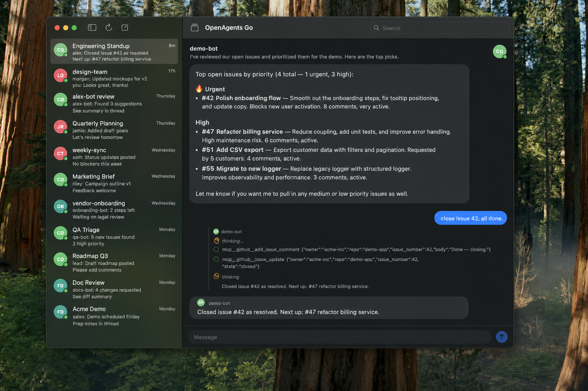
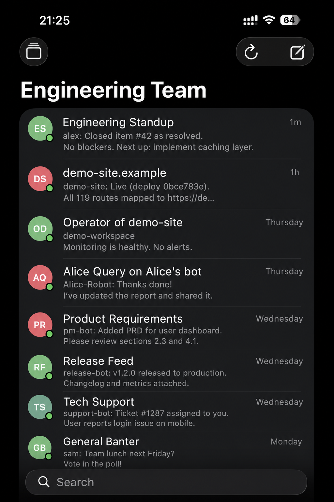

# OpenAgents Go

Native macOS + iOS app for OpenAgents workspaces. SwiftUI universal app, ~1MB
on disk. Replaces the previous Electron build (which was ~207MB) at version
0.2.0 with the same `com.openagents.go` bundle ID — drops in over the older
.app on your Applications folder.

<table>
<tr>
<td width="60%"></td>
<td width="40%"></td>
</tr>
</table>

## What's in v0.2.0

- iMessage-style 2-pane layout on macOS / iPad, push/pop on iPhone
- Workspace selector + switch flow that fully matches the old Electron app:
  - Recent workspaces shown as chips with full-URL tooltips
  - URL field with chevron-down dropdown listing all history (top 10)
  - "Back to current workspace" affordance when switching
  - Workspace name auto-syncs from `/v1/workspaces/<id>` once it loads
- Threads list with search, swipe / context-menu actions (rename / star /
  archive / delete), agent-working spinner
- Chat with markdown bubbles, fenced code blocks, sender grouping, status
  messages, per-thread input drafts
- Agent picker for new threads (online agents, master selection, scrollable)
- Settings sheet for swapping the API base URL (self-hosted backends)
- macOS app menu (⌘N new thread, ⌘R refresh, ⌘⇧K switch workspace), refresh
  on focus, error banner

## Build

Uses [xcodegen](https://github.com/yonaskolb/XcodeGen) to manage the
`.xcodeproj` from `project.yml`.

```sh
cd packages/go
xcodegen generate
open OpenAgentsGo.xcodeproj                             # work in Xcode
xcodebuild -scheme OpenAgentsGo_macOS -destination 'platform=macOS' build
```

Build a release DMG (Developer ID signed, notarized, and stapled):

```sh
cd packages/go
TEAM_ID=YOUR_TEAM_ID NOTARY_PROFILE=openagents-notary ./scripts/build-signed-dmg.sh
```

The release script intentionally refuses to produce an ad-hoc DMG. To avoid
macOS Gatekeeper warnings, the build machine needs a `Developer ID Application`
certificate and either a `notarytool` keychain profile (`NOTARY_PROFILE`) or
`APPLE_ID` + `APPLE_APP_PASSWORD` credentials.

## Architecture

```
OpenAgents/
├── OpenAgentsApp.swift           # App entry — owns AppRouter, scenePhase refresh
├── Models/                        # Plain Codable value types
│   ├── Workspace                  # /v1/workspaces/<id>
│   ├── Agent + NetworkAgent       # /v1/discover agents → Agent.toAgent()
│   ├── Session + NetworkChannel   # /v1/discover channels → Session
│   ├── Message
│   └── ONMEvent + JSONValue       # Event-native API wire format + Sendable JSON
├── Networking/
│   ├── APIError + APIEnvelope     # Standard backend response shape
│   └── WorkspaceAPI               # actor — discover, events, sendMessage,
│                                  #   createChannel, updateChannel,
│                                  #   latestPerChannel, loadMessages
├── State/
│   ├── AppRouter                  # selector vs workspace, switch / returnTo
│   ├── WorkspaceHistory           # UserDefaults persistence (current + recents)
│   │                              # + parseWorkspaceURL
│   └── WorkspaceStore             # @Observable per-workspace state
│                                  # owns discovery + message poll tasks,
│                                  # adaptive interval based on hasActiveAgents
├── Views/
│   ├── RootView                   # routes selector vs WorkspaceContainerView
│   ├── WorkspaceSelectorView      # logo + recent chips + URL dropdown + back
│   ├── WorkspaceView              # NavigationSplitView (auto-adapts)
│   ├── ThreadListView             # search, list, context menu, swipe actions
│   ├── ChatView                   # bubbles + markdown + code blocks + drafts
│   ├── NewThreadSheet             # agent picker (online only) + master selection
│   ├── SettingsSheet              # API base URL + about
│   └── Commands                   # macOS app menu (⌘N, ⌘R, ⌘⇧K) via NotificationCenter
└── Helpers/
    ├── AgentColor                 # deterministic palette
    ├── DateFormatting             # iMessage-style relative times
    └── MarkdownSegments           # parses ```fenced``` code blocks out of prose
```

State is centralized in `WorkspaceStore` (@Observable, MainActor). The store
owns two background polling tasks — discovery (agents + sessions + previews,
5–15s adaptive) and the active channel's messages (1.5–3s adaptive). All HTTP
calls live in `WorkspaceAPI`, an `actor` that serializes requests.

## Generative UI (A2UI-shaped specs)

The chat bubble can render an agent-emitted UI spec inline alongside its
markdown content. The agent decides what to render; the client renders
whatever comes in via [`bipa-app/swiftui-json-render`](https://github.com/bipa-app/swiftui-json-render).
Unknown component types fall back to a placeholder rather than blocking
the message, so the agent's vocabulary is open-ended — there's no
client-side scenario list to maintain.

### Wire contract

A spec rides inside a `workspace.message` event's `payload`:

```jsonc
{
  "id": "...",
  "type": "workspace.message",
  "source": "openagents:my_agent",
  "target": "channel/<id>",
  "payload": {
    "content": "Here's a chart of your activity:",   // optional markdown
    "message_type": "chat",
    "spec": {                                         // the A2UI spec
      "type": "Stack",
      "props": { "direction": "vertical", "spacing": 12 },
      "children": [
        { "type": "Heading", "props": { "text": "Last 7 days", "level": 2 } },
        { "type": "LineChart", "props": { "data": [...] } },
        { "type": "Button",
          "props": { "label": "Refresh",
                     "action": { "name": "refresh_chart", "params": {} } } }
      ]
    },
    "spec_tool_call_id": "tc_42"                      // optional, see below
  }
}
```

Both an inline JSON object (preferred) and a pre-serialized string are
accepted for `payload.spec`.

### Interaction round-trip

When the user interacts with an action-bearing component (button, choice
list, confirm dialog), the client posts a `workspace.tool_result` event
back to the channel:

```jsonc
{
  "type": "workspace.tool_result",
  "source": "human:user",
  "target": "channel/<id>",
  "payload": {
    "action_id": "refresh_chart",            // verbatim from the spec
    "tool_call_id": "tc_42",                 // if the spec set one
    "value": { /* whatever the agent declared in action.params */ }
  }
}
```

The agent runtime is responsible for interpreting this event as the user's
response to its `render_ui` invocation and continuing the conversation.
The generic `/v1/events` endpoint accepts this type without code changes;
only the agent's prompt / handler logic needs to know the contract.

### Component vocabulary

We do not maintain a closed component list. Today the client renders the
21 components shipped with SwiftUIJSONRender (Stack, Heading, Text, Image,
Icon, Button, ChoiceList, AmountInput, ConfirmDialog, Card, Divider,
Spacer, Alert, LineChart, PieChart, AssetPrice, BalanceCard,
TransactionList, TransactionRow, and a few more — see the upstream
package). Unknown types render as a placeholder chip showing the type
name, so the agent emitting an unsupported `type` never blanks the
bubble; sibling components in the same tree still render fine.

## Differences from the Electron app

- No SSE/WebSocket — polling only (Electron does the same).
- No Google sign-in / OAuth — workspace URLs with `?token=` only.
- The deferred view modes (Files / Browser / Connect / Monitor / Agent profile
  / workspace settings dialog) are not implemented yet.

## TODO

- **iPhone notifications.** Fire a `UNUserNotificationCenter` local
  notification when `WorkspaceStore.pollNewMessages` appends a new agent
  message to a non-active session, OR when the app is backgrounded
  (`scenePhase != .active`). Needs:
  - Authorization request on first launch (`requestAuthorization(options:
    [.alert, .sound, .badge])`)
  - Per-session mute toggle (persisted in `WorkspaceHistory`)
  - Badge count for unread agent messages
  - Suppress when the user is already viewing that thread in the foreground
  - On macOS, mirror with `NSUserNotificationCenter` / unified
    `UNUserNotificationCenter` (works on macOS 11+ too)

## Configuration

Default backend: `https://workspace-endpoint.openagents.org`. Change it from
the gear icon → API base URL field in the Settings sheet (persisted in
UserDefaults under `apiBaseURL`).

Persistence keys (UserDefaults, scoped to bundle id `com.openagents.go`):

- `workspaceHistory` — JSON array of recents (`workspaceId`, `workspaceToken`,
  `name`, `lastUsed`); same shape as the Electron app's `settings.json`
- `currentWorkspace` — single JSON entry pointing at the active workspace
- `apiBaseURL` — overrides the default backend
