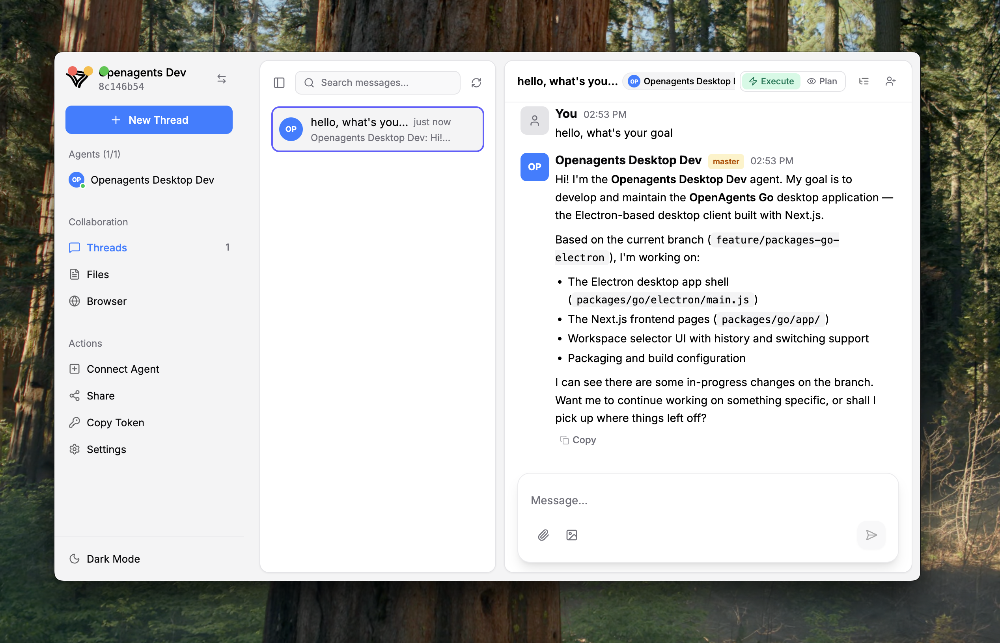
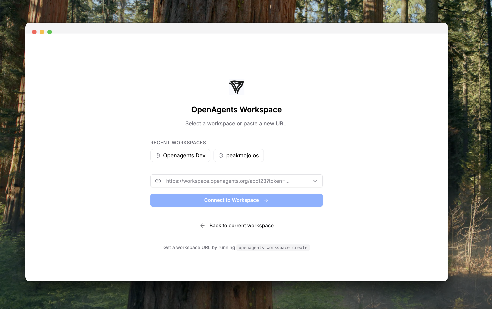

# OpenAgents Go

Electron desktop app for OpenAgents workspaces.





## Development

```bash
cd packages/go
npm install
npm run electron:dev
```

## Build & Install

```bash
npm version patch
npm run electron:build
```

Output in `dist/` — `.dmg` (macOS), `.exe` (Windows), `.AppImage` (Linux).

macOS: open the `.dmg`, drag "OpenAgents Go" to Applications.

## TODO

- [ ] Restore last active thread on relaunch
- [ ] Persist light/dark mode preference across sessions
- [ ] Default sidebar to collapsed state
